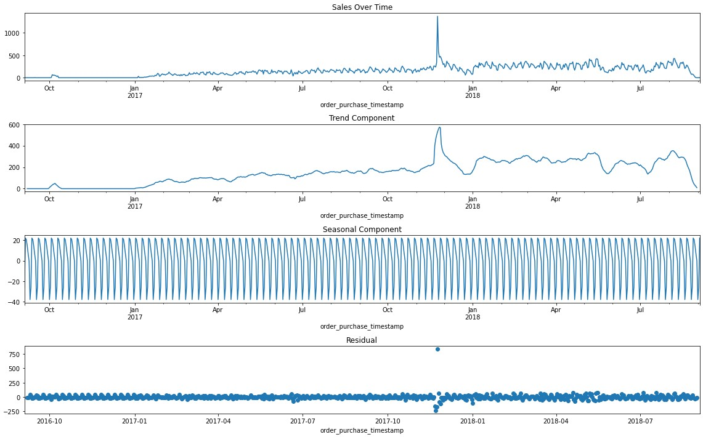
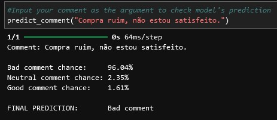
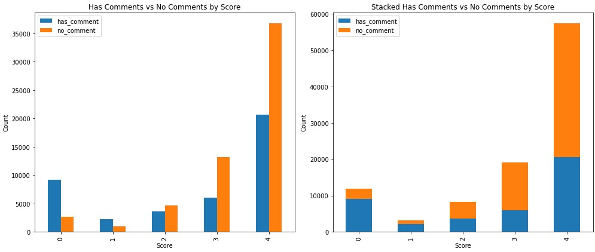
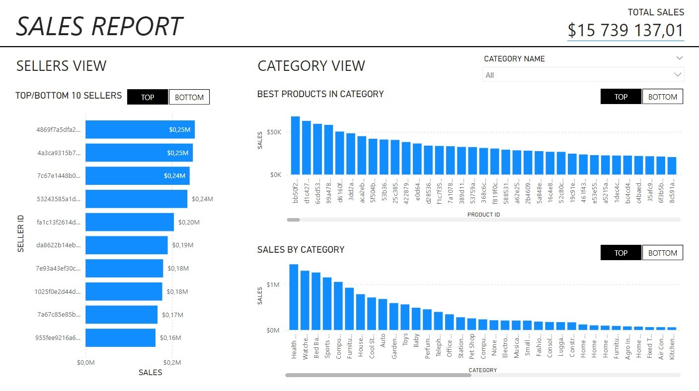

# SALES AND PRODUCTS ANALYSIS
Python and PowerBI analysis of the Brazilian E-Commerce Public Dataset by Olist.

The project is divided into 4 parts: 
• [Demand forecasting models](https://github.com/Foggy101/sales_and_products_analysis/blob/main/demand_forecasting.ipynb) (ARIMA and random forest) in Python 
• [Review sentiment analysis](https://github.com/Foggy101/sales_and_products_analysis/blob/main/review_semantics_prediction_model.ipynb) (neural network) in Python 
• [Review analytics](https://github.com/Foggy101/sales_and_products_analysis/blob/main/review_semantics_review_analytics.ipynb) in Python 
• [Sales and products dashboard](https://github.com/Foggy101/sales_and_products_analysis/tree/main/images) in PowerBI (*links to images*)

<h2>DEMAND FORECASTING</h2>
The main goal of this part is to implement a demand forecasting system for a short-term period (14 days) 7 days from the last date. The forecasts would then be used to optimize inventory levels - ensuring enough stock to meet customer demand without overstocking - and thus reducing stocking spend.  
After performing time series decomposition, two models are built - SARIMA and random forest. They both can be used for category and product forecasts, depending on the selected setting. Both models yield similar forecasts and the default recommended approach is to take both results and average them for the final forecast.  
<strong>EXAMPLE IMAGE: TIME SERIES DECOMPOSITION</strong> 

<h2>REVIEW SENTIMENT ANALYSIS</h2>
This part is dedicated to creating a review classification neural network. The aim of the model is distinguishing between positive/neutral/negative text reviews left by customers. The code includes a way for users to input a custom comment and make the model evaluate it. Keep in mind that the comment has to be in portuguese.  
<strong>EXAMPLE IMAGE: USER INPUT PREDICTION</strong> 

<h2>REVIEW ANALYTICS</h2>
The third part is also related to customer reviews. It provides additional analysis on selected business cases. 
• It checks the correlation between review scores and whether a comment was left. 
• Shows products with best and worst reviews. 
• Filter for sellers with negative reviews only. 
• Highlights price mentions in text comments so that it's possible to look through this information for mentions of the competitors’ prices.  
<strong>EXAMPLE IMAGE: REVIEW SCORE VS COMMENT LEFT</strong> 

<h2>SALES AND PRODUCTS DASHBOARD</h2>
The goal of the last part is creating an interactive dashboard for a stakeholder to draw insights from. It focuses on best and worst sellers and products within product caregories, but it also has an additional tab dedicated to analysis the impact of weight of products on their price and total sales.  
FOR MORE IMAGES GO TO: <a href="https://github.com/Foggy101/sales_and_products_analysis/tree/main/images">LINK</a>
  
<strong>EXAMPLE IMAGE: MAIN VIEW</strong> 

